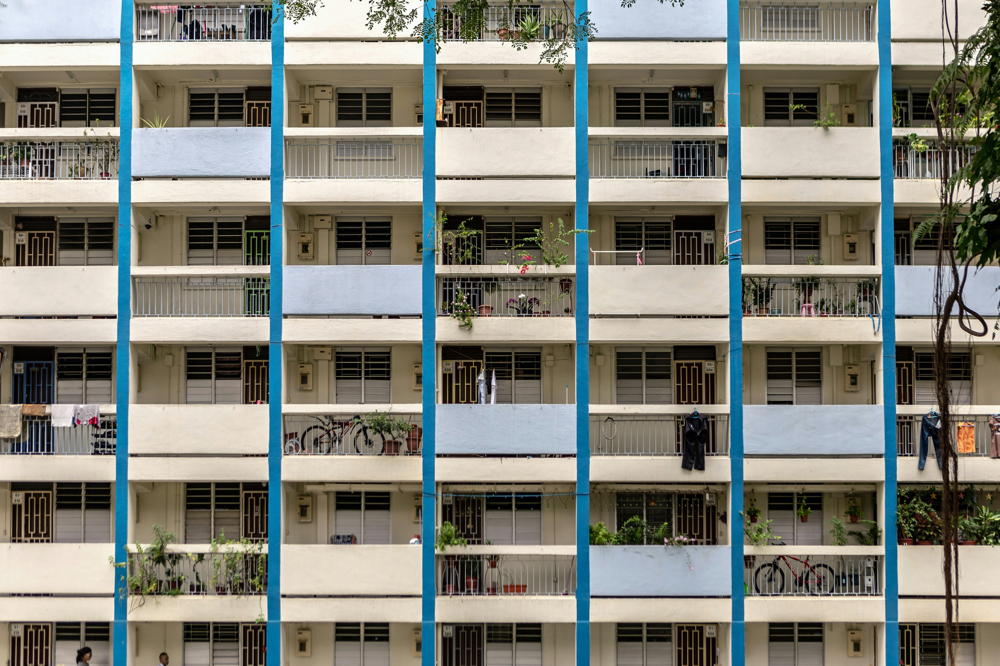
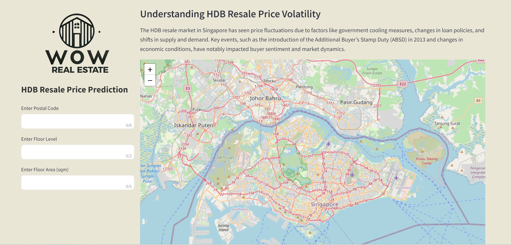
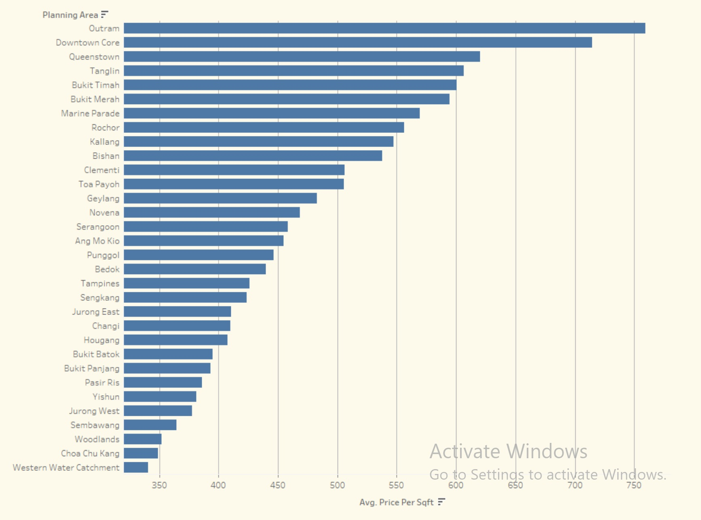
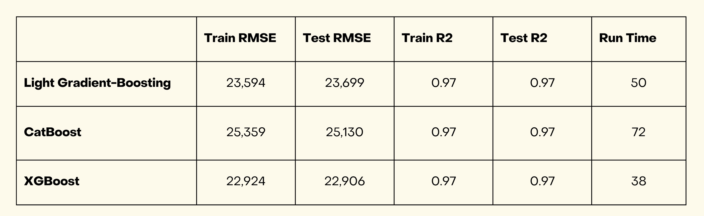

# HDB-resale-price
 - [Background](#Background)
 - [Problem Statement](#Problem-Statement)
 - [Data Sources](#Data-Sources)
 - [Executive Summary](#Executive-Summary)
 - [Reflection](#Reflections)
 - [Conclusion](#Conclusion)
 

## Background

From 2012 to 2021, Housing and Development Board (HDB) resale prices in Singapore experienced significant fluctuations due to various policy changes, market demand, and economic factors. In 2013, the Singapore government implemented several cooling measures, including the Total Debt Servicing Ratio (TDSR) framework and a reduction in the Mortgage Servicing Ratio (MSR) for HDB loans, which led to a decline in resale prices from 2014 to 2017. However, from 2018 onwards, the HDB resale market began to recover, driven by factors such as a stable economy and increased demand for public housing.

By 2020, the COVID-19 pandemic had created unique pressures on the market, including delays in the construction of new Build-to-Order (BTO) flats, which drove more buyers to the resale market. Consequently, 2020 and 2021 saw a surge in HDB resale prices, with prices reaching record highs in some areas.

## Problem Statement
Estate agents face several challenges in this dynamic market. These include accurately pricing properties in a fluctuating market, managing client expectations amid rising prices, and navigating the complexities of government regulations. Additionally, there is a growing trend for new homeowners to prioritise purchasing homes near top schools, further intensifying competition in certain areas, which adds another layer of complexity for agents trying to meet client demands.

And so the problem we want to address here is: 

**Can we use machine learning to make predictions for resale prices?**

We will follow the data science process to answer this problem.
1. Define the problem
2. Gather & clean the data
3. Explore the data
4. Model the data
5. Evaluate the model
6. Answer the problem

--- 
## Data Sources
The dataset contains HDB resale data from March 2012 to April 2021. The dataset contains 150,634 rows and 78 columns. The data can be downloaded from Kaggle at this [link](https://www.kaggle.com/competitions/dsi-sg-project-2-regression-challenge-hdb-price/data).

The data dictionary can be accessed through the link above.

## Executive Summary
**INTRODUCTION**

This project seeks to make predictions on the outcome of HDB resale prices through regression models. With the prediction price, agents will be able to use different strategies to meet their client's needs. 

**METHODOLOGY**

1. Preprocessing - Cleaning and tidying of data, Feature Engineering
2. EDA - Data visualisation and analysis of key patterns
3. Regression Modelling - Testing dataset fitted on 3 models to get regression predictions
5. Evaluation - Evaluation of results, Feature Importance
6. Backtesting - Using test data to answer the problem statement of whether we can predict resale prices
7. Deployment - To build an application using Streamlit, where agents can key in simplified inputs to get a prediction on the resale price.

The application was deployed on Streamlit and can be accessed through this [link](https://hdb-resale-price.streamlit.app/). A screenshot showing the app is shown below. Please note that this app was only intended as an educational and demo tool, and not meant to be used for real life house planning.

**FEATURES SELECTION/ADDITION**

Based on the original dataset, we conducted an intensive EDA to identify the features we wanted to use for our analysis.

For example, we use a bar chart, as shown below, to show how planning area feature affects the resale price

As we can see from the chart, it reflects how location strongly influences property prices in Singapore, with central areas being more premium.
We also created a new numeric classification feature named avg_desirability_rounded to further categorize primary schools based on their desirability.
In the end, we decided to focus on the 13 variables listed below for our machine learning phase.
1. Tranc_YearMonth
2. full_flat_type
3. mrt_name
4. building_age
5. planning_area
6. floor_area_sqm
7. max_floor_lvl
8. Hawker_Nearest_Distance
9. mrt_nearest_distance
10. pri_sch_nearest_distance
11. mid_storey
12. Mall_Nearest_Distance
13. avg_desirability_rounded

**SIGNIFICANT FINDINGS**

Based on a context of structured tabular dataset, we managed to filter out the three strongest options for modeling which are Light Gradient Boosting Machine (LightGBM), CatBoost and Extreme Gradient Boosting Machine (XGBoost).

We further analysed performance of three machine learning models using metrics such as Train RMSE, Test RMSE, Train R², Test R² and Run Time (s). 

Here is the analysis
1. Light Gradient Boosting Machine
This model shows strong performance with a low RMSE (Root Mean Square Error) on both the training and test datasets, indicating good predictive accuracy.The R² (coefficient of determination) of 0.97 is high, signifying that the model explains 97% of the variance in the data.
The run time of 50 seconds suggests that the model is relatively fast.
2. CatBoost
This model also performs well, with slightly higher RMSE values compared to LightGBM. However, the difference is minimal, and the model still maintains high accuracy.The R² is consistent at 0.97, indicating that it explains 97% of the data’s variance, similar to LightGBM.
The run time is 72 seconds, making it slower than LightGBM but still within a reasonable range.
3. XGBoost
XGBoost has the lowest RMSE among the three models, indicating the best predictive performance on both the training and test datasets.
The R² is consistent at 0.97, similar to the other models, explaining 97% of the variance in the data.
The run time is the fastest at 38 seconds, making XGBoost not only the most accurate but also the most efficient in terms of computational speed.

Overall Summary
LightGBM is a strong contender with very close performance metrics to XGBoost and a slightly longer run time.
CatBoost is still a solid model, particularly when we have a lot of categorical data, but it lags slightly behind in terms of RMSE and run time.
XGBoost outperforms the other two models in terms of both accuracy (lowest RMSE) and efficiency (shortest run time). It is our final model of choice since we prioritize predictive performance and computation time.

---
## Reflections
We want to reflect on key stages in our team work process:
1. Data Handling
- Cleaning & Feature Engineering: The team effectively cleaned the data and engineered key features, like flat_type and hdb_age, which were crucial for accurate predictions.
- Variable Selection: Relevant variables were carefully chosen, including handling categorical data properly and exploring interactions, improving model accuracy.
2. Model Fine-Tuning
- Hyperparameter Tuning: The team used grid and random search techniques to optimize hyperparameters, ensuring models were finely tuned for performance.
- Cross-Validation: Cross-validation helped prevent overfitting and ensured the models generalized well.
- Technical Challenges: Challenges like balancing model complexity with run time and handling large datasets were tackled effectively, ensuring efficient model training.
Summary
The team’s strong approach to data handling, variable selection, and model fine-tuning, combined with overcoming technical challenges, led to the development of accurate and reliable models for predicting HDB resale prices.
---
## Conclusion

In this project, we aimed to predict HDB resale prices in Singapore by leveraging a comprehensive dataset that included various factors such as the property's location, type, size, age, and proximity to amenities. Through careful data handling, feature engineering, and model selection, we successfully identified key variables that significantly impact resale prices. By comparing advanced machine learning models—LightGBM, XGBoost, and CatBoost—we were able to fine-tune and validate our models to achieve high accuracy and reliability. The results demonstrate the effectiveness of these models in capturing the complexities of the HDB resale market, providing valuable insights for stakeholders and setting the stage for future enhancements and potential real-world applications.
